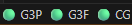

# 🚀 Antigravity Watcher

[](https://opensource.org/licenses/MIT)
[](https://code.visualstudio.com/)
[](https://open-vsx.org/extension/htng-dev/antigravity-watcher)
[](https://www.typescriptlang.org/)

**Keep your flow, know your limits.** Antigravity Watcher is a premium VS Code extension designed to provide real-time monitoring of your Antigravity AI quotas and usage, directly within your favorite editor.


## ✨ Features

### 📊 Rich Visualizations
Stay on top of your usage with beautiful, real-time charts in the Activity Bar. Monitor multiple model groups (Gemini, Claude, GPT, Mistral) with smooth gradients and glassmorphism-inspired UI.

### 🎯 Proactive Monitoring
*   **Status Bar Integration**: Get a quick heart-beat check of your primary quotas at a glance.
*   **Color-Coded Health**: Instant visual feedback (🟢 Healthy, 🟡 Warning, 🟠 Low, 🔴 Critical).
*   **Precise Countdown**: Know exactly when your quotas will reset, down to the minute.

### 🤖 Intelligent Automation
*   **Zero-Config Discovery**: Automatically finds your running Antigravity instance—no manual port input or API key configuration needed.
*   **Smart Grouping**: Automatically groups models that share common tokens or request pools.
*   **Auto-Update**: Background refresh keeps data fresh without interrupting your coding sessions.

## 📸 Screenshots

### Status Bar Glance

*Quickly monitor your most-used models without leaving your code.*

---

## 🚀 Getting Started

### Prerequisites
- [Visual Studio Code](https://code.visualstudio.com/) v1.80.0 or higher.
- [Antigravity](https://github.com/jlcodes99/vscode-antigravity-cockpit) application running on your local machine.

### Installation

#### 🛠️ Using Antigravity CLI (Recommended)
You can install **Antigravity Watcher** directly using the Antigravity command line:
```bash
antigravity --install-extension htng-dev.antigravity-watcher
```

#### 🧩 From the Antigravity Extension
If you are already using the [Antigravity](https://github.com/jlcodes99/vscode-antigravity-cockpit) extension, you can find and install the **Watcher** directly from within the Antigravity interface.

#### 🏪 From the VS Code Marketplace
1. Open VS Code and go to the **Extensions** view (`Ctrl+Shift+X`).
2. Search for **"Antigravity Watcher"**.
3. Click **Install**.

Alternatively, find it on the [Open VSX Registry](https://open-vsx.org/extension/htng-dev/antigravity-watcher).

#### Build from Source
```bash
git clone https://github.com/HuyTranNG/antigravity-watcher.git
cd antigravity-watcher
npm install
npm run compile
```

---

## 🛠️ Usage

### 1. The Activity Bar
Click the **Antigravity icon** in the Activity Bar to open the primary dashboard. Here you'll see:
- Detailed usage percentages per model group.
- Visual bar charts with dynamic color states.
- Precise reset timestamps and countdown badges.

### 2. The Status Bar
Check the bottom-right of your editor for immediate status updates.
- **Click** the status item to trigger a manual refresh or see detailed info.

### 3. Command Palette
Press `Ctrl+Shift+P` (or `Cmd+Shift+P` on macOS) and type:
- `Antigravity watcher: Check Quota` - Forces a manual data fetch.
- `Antigravity watcher: Open Settings` - Configure thresholds and refresh rates.

---

## ⚙️ Configuration

| Setting | Type | Default | Description |
| :--- | :--- | :--- | :--- |
| `refreshInterval` | `integer` | `2` | Update frequency in minutes. |
| `thresholds.high` | `number` | `0.8` | Threshold for Green (Healthy). |
| `thresholds.medium`| `number` | `0.3` | Threshold for Yellow (Warning). |
| `thresholds.low` | `number` | `0.05`| Threshold for Orange (Low). |
| `icons` | `object` | 🟢, 🟡, 🟠... | Custom emoji/icons for each status level. |

---

## 📂 Project Structure

- `src/extension.ts` - Core activation logic.
- `src/chartView.ts` - Webview provider for the Activity Bar dashboard.
- `src/hunter.ts` - Advanced process discovery engine.
- `src/reactor.ts` - Antigravity API communication layer.
- `resources/` - Visual assets and extension icons.

---

## 🆘 Troubleshooting

**"Antigravity not found"**
1. Ensure the Antigravity application is active and running.
2. Verify you have permissions to view running processes (especially on Linux/macOS).
3. Check the VS Code "Output" panel for detailed logs under "Antigravity Watcher".

---

## 📜 Credits & License

Built with ❤️ by [htng-dev](https://github.com/HuyTranNG).
Based on the original [vscode-antigravity-cockpit](https://github.com/jlcodes99/vscode-antigravity-cockpit).

Distributed under the **MIT License**. See `LICENSE` for more information.
